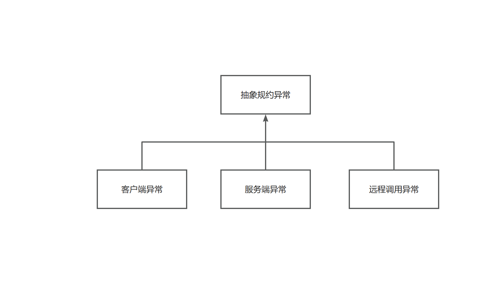
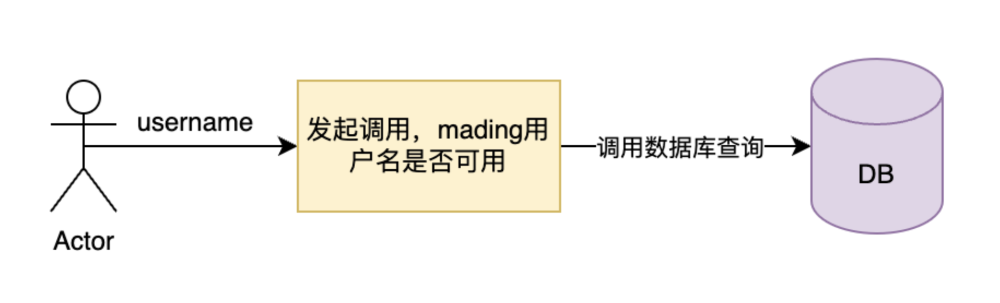
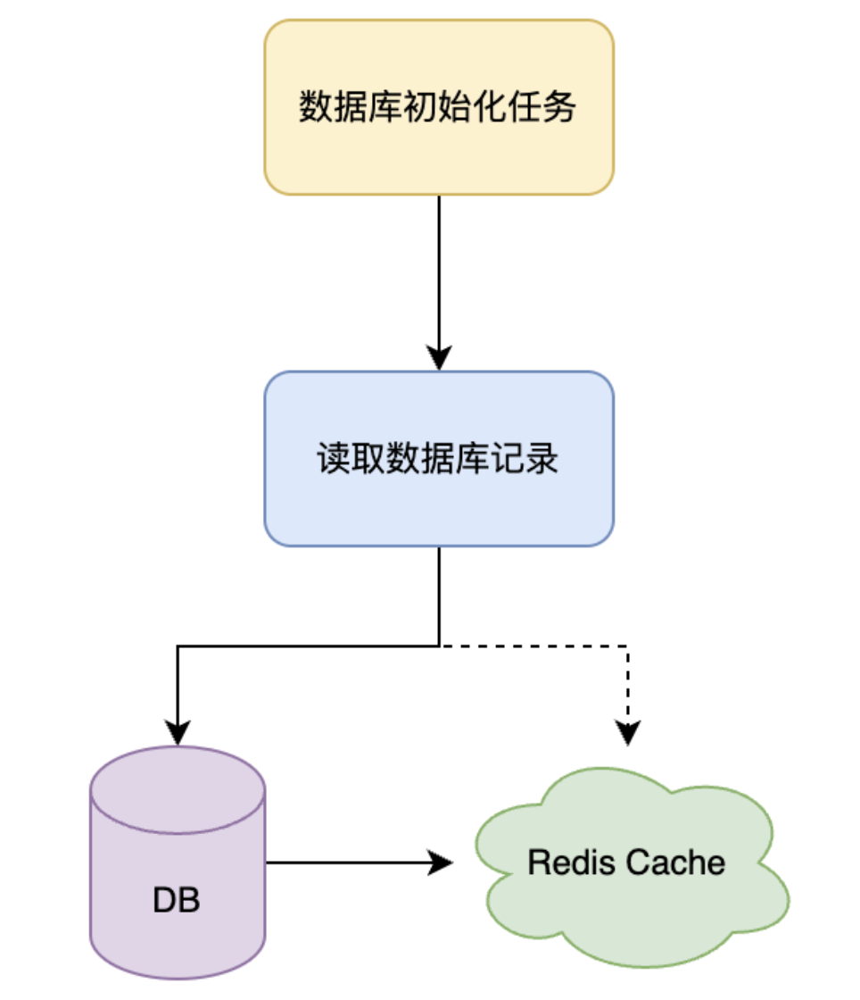
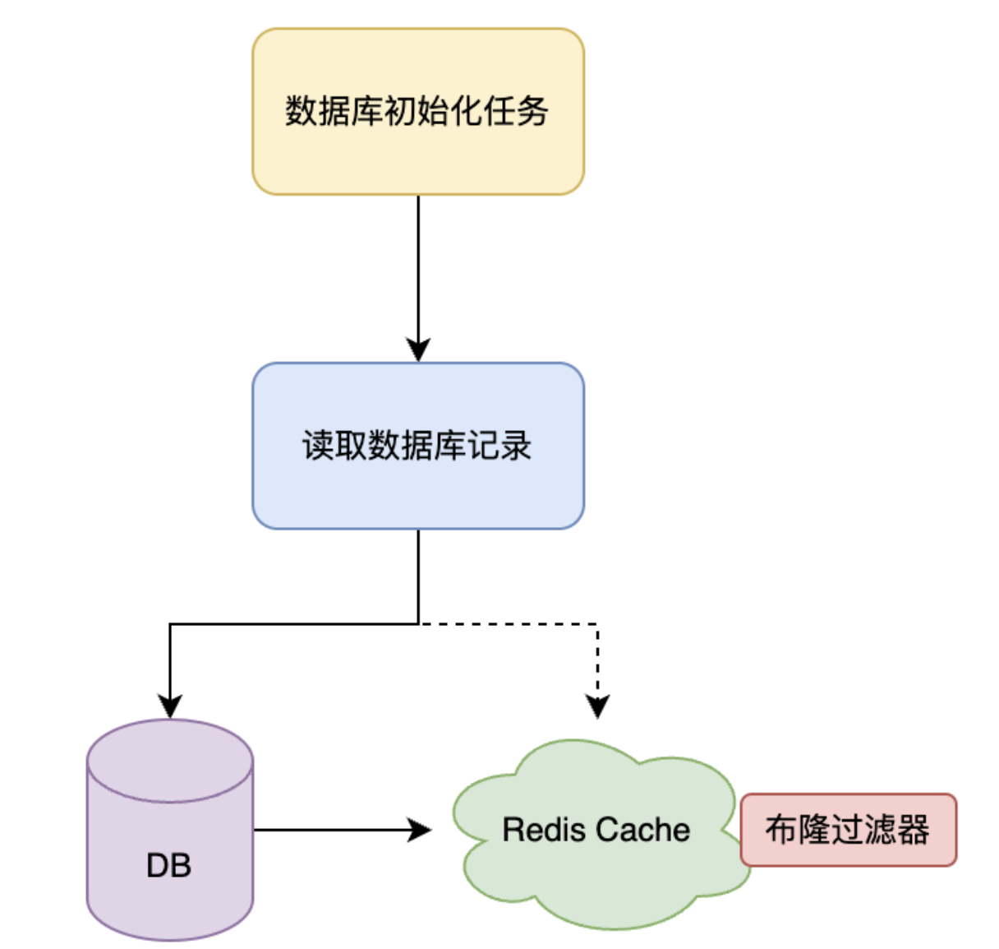
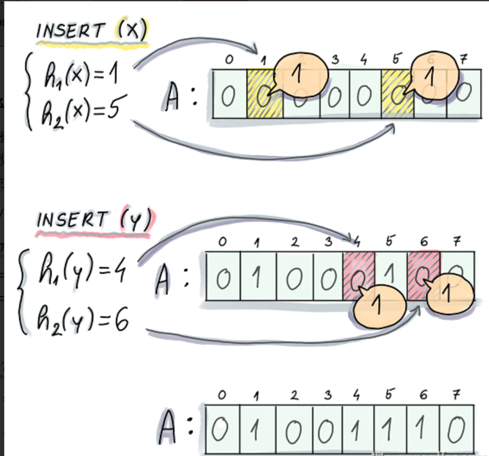
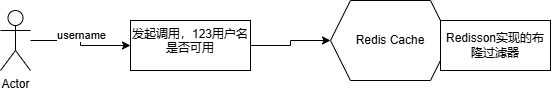
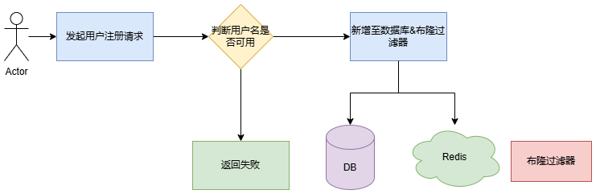

# Long2Short

长链接转化为短连接

## 后管系统（admin）

### 用户模块

主要用来管理用户

#### 功能分析

- 检查用户名是否存在（前置流程，区分用户唯一标识）
- 注册用户
- 修改用户
- 根据用户名查询用户
- 用户登录
- 检查用户登录状态（是否）
- 用户退出登录
- 注销用户

#### 全局配置

##### 全局返回实体对象

```java
  public class Result<T>{
    /**
     * 返回码
     */
    private String code;

    /**
     * 返回消息
     */
    private String message;

    /**
     * 响应数据
     */
    private T data;

    /**
     * 请求ID
     */
    private String requestId;
}
```

##### 全局异常码设计

1. 异常码说明
   根据阿里巴巴开发手册泰山版错误码为字符串类型，共 5 位，分成两个部分：错误产生来源+四位数字编号。说明：错误产生来源分为 A/B/C,四位数字编号从 0001 到 9999，大类之间的步长间距预留 100。。

- **A 表示错误来源于用户**，比如参数错误，用户安装版本过低，用户支付超时等问题；
- **B 表示错误来源于当前系统**，往往是业务逻辑出错，或程序健壮性差等问题；
- **C 表示错误来源于第三方服务**，比如 CDN 服务出错，消息投递超时等问题。
  异常码分类：一级宏观错误码、二级宏观错误码、三级详细错误码。
  客户端异常：


  | 错误码 | 中文描述           | 说明           |
  | ------ | ------------------ | -------------- |
  | A0001  | 用户端错误         | 一级宏观错误码 |
  | A0100  | 用户注册错误       | 二级宏观错误码 |
  | A0101  | 用户未同意隐私协议 |                |
  | A0102  | 注册国家或地区受限 |                |
  | A0110  | 用户名校验失败     |                |
  | A0111  | 用户名已存在       |                |
  | A0112  | 用户名包含敏感词   |                |
  | A0200  | 用户登录异常       | 二级宏观错误码 |
  | A02101 | 用户账户不存在     |                |
  | A02102 | 用户密码错误       |                |
  | A02103 | 用户账户已作废     |                |

  服务端异常：


  | 错误码 | 中文描述           | 说明           |
  | ------ | ------------------ | -------------- |
  | B0001  | 系统执行出错       | 一级宏观错误码 |
  | B0100  | 系统执行超时       | 二级宏观错误码 |
  | B0101  | 系统订单处理超时   |                |
  | B0200  | 系统容灾功能被触发 | 二级宏观错误码 |
  | B0210  | 系统限流           |                |
  | B0220  | 系统功能降级       |                |
  | B0300  | 系统资源异常       | 二级宏观错误码 |
  | B0310  | 系统资源耗尽       |                |
  | B0311  | 系统磁盘空间耗尽   |                |
  | B0312  | 系统内存耗尽       |                |

  远程调用异常：


  | 错误码 | 中文描述           | 说明           |
  | ------ | ------------------ | -------------- |
  | C0001  | 调用第三方服务出错 | 一级宏观错误码 |
  | C0100  | 中间件服务出错     | 二级宏观错误码 |
  | C0110  | RPC服务出错        |                |
  | C0111  | RPC服务未找到      |                |
  | C0112  | RPC服务未注册      |                |

2. 异常码设计

```java
public interface IErrorCode {
    /**
     * 错误码
     * @return
     */
     String code();
     /**
      * 错误信息
      * @return
      */
     String message();
}

```

##### 全局异常拦截器



```java
public abstract class AbstractException extends RuntimeException {

    public final String errorCode;

    public final String errorMessage;

    public AbstractException(String message, Throwable throwable, IErrorCode errorCode) {
        super(message, throwable);
        this.errorCode = errorCode.code();
        this.errorMessage = Optional.ofNullable(StringUtils.hasLength(message) ? message : null).orElse(errorCode.message());
    }
}

```

## 用户注册

### 检查用户名是否存在

流程图

存在的问题：
海量用户查询时，全部请求数据库，会将数据库直接打满。
解决方案：

1. 用户名加载缓存
   将所有用户名加载到Redis缓存中
   流程图
   
   该方案存在的问题：

- 由于全部加载，只能设置永久数据
- 永久数据的Redis内存占用过高

2. 布隆过滤器
   在Redis缓存中引入布隆过滤器判断
   流程图：
   
   布隆过滤器是一种数据结构，用于快速判断一个元素是否存在于一个集合中。具体来说，布隆过滤器包含一个位数组和一组哈希函数。位数组的初始值全部置为
   0。在插入一个元素时，将该元素经过多个哈希函数映射到位数组上的多个位置，并将这些位置的值置为 1。
   
   在查询一个元素是否存在时，会将该元素经过多个哈希函数映射到位数组上的多个位置，如果所有位置的值都为
   1，则认为元素存在；如果存在任一位置的值为 0，则认为元素不存在。
   优点：

- 高效判别元素是否存在大规模集合中
- 节省内存
  缺点：
- 可能存在一定的误判率（不存在判断为存在）
  因而要对布隆过滤器设置合理的初始容量。初始容量越大，冲突几率越低。可以设置预期的误判率。
  在判断用户名是否存在的场景中，倘若将不存在的用户名判断为存在，例如123，对用户来说，可以修改为1234继续尝试，修改成本很低。
  如图为布隆过滤器执行流程图
  

3. 代码中引入布隆过滤器

```java
//核心有两个参数，expectedInsertions和fasleProbability
boolean tryInit(long var1,double var3);
```

tryInit 有两个核心参数：

- expectedInsertions：预估布隆过滤器存储的元素长度。
- falseProbability：运行的误判率。

错误率越低，位数组越长，布隆过滤器的内存占用越大。
错误率越低，散列 Hash 函数越多，计算耗时较长。
因此使用布隆过滤器的场景

- 初始使用：注册用户时就向容器中新增数据，就不需要任务向容器存储数据了。
- 使用过程中引入：读取数据源将目标数据刷到布隆过滤器。

### 用户注册功能

偶然发现，MyBatis-Plus从3.3.0版本开始，默认的ID生成器使用雪花算法结合不含中划线的UUID作为ID生成方式。这样的方式在分布式系统中生成的ID是唯一的，且是递增的，方便数据库索引。
用户注册流程图：


1. 如何防止用户名重复？
   通过布隆过滤器把所有用户名进行加载，这样功能就能完全隔离数据库，并且在数据库层进行兜底，添加用户名唯一的索引。
2. 如何防止恶意请求大量注册同一个未注册的用户名？
   因为该用户名未注册，所以布隆过滤器不存在，代表可以插入数据库。但是恶意请求同一个用户名，这些请求都会落到数据库上，导致数据库压力过大。通过分布式锁，锁定该用户名进行串行执行，这样就能保证数据库不会受到恶意请求的影响。
3. 如果恶意请求全部使用未注册用户名发起请求
   这样暂时无法避免，只能通过限流的方式，限制每个用户的注册次数，或者通过验证码的方式，增加注册的成本。
